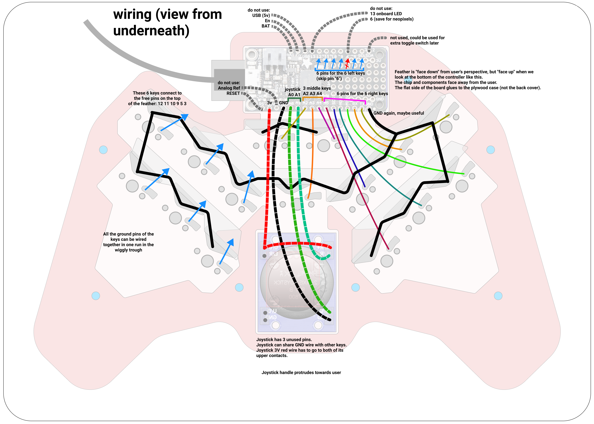

# Thumble

A MIDI controller in the shape of a video game controller (e.g. xbox), but using mechanical-keyboard hardware.

## How it's designed musically; how to play it

Hold it like an Xbox controller.  Play it like a kalimba, with your thumbs.

The diagonal keys are notes; the 3 keys in the middle are extra function keys.  The joystick is for pitch bends, etc.

Unlike a kalimba, the notes are arranged piano style.  There's one octave starting at B on the left and ascending to Bb on the right.  Generally, white keys are on the bottom row and black keys are on the top row.

The special middle keys P, Q, and R have not been assigned to functions yet.  One will be a Shift key which accesses hidden features in the other keys such as transposing, changing MIDI channels, changing system volume, etc.

## Shepard Tones

There's only room for 12 notes, but wouldn't it be nice if you could wrap around the edge when playing a melody without jumping an octave?

We use an auditory illusion called [Shepard Tones](https://en.wikipedia.org/wiki/Shepard_tone) to make this possible.  Each key actually plays several octaves of that note at the same time, but with louder notes in the middle octaves, to maintain the loudest note in the same octave despite the illusion of constantly ascending tones.

For example:
* C plays C1 at 50% and C2 at 50% volume.
* D plays D1 at 58% and D2 at 42%.
* ...etc, with the upper octave fading away until we get to the middle of the scale and the upper octave is gone.  Then we start bringing in the octave below...
* F plays F1 at 92% and F2 at 8%.
* F# plays F#1 at 100%
* G plays G0 at 8% and G1 at 92%
* and eventually we end up back where we started:
* B plays B0 at 42% and B1 at 58%

## Hardware

1. Microcontroller: [Feather 32u4 basic proto](https://www.adafruit.com/product/2771), from Adafruit
2. Cherry MX compatible keyswitches (x 15)
    * I used [Gateron Silent Clear](https://novelkeys.xyz/products/gateron-silent-switches?_pos=2&_sid=fd79d8abc&_ss=r) since they have the weakest springs available and no tactile bump
3. Keycaps (x 15)
    * I used these [XDA profile](https://www.amazon.com/gp/product/B092H93KP6/ref=ppx_yo_dt_b_asin_title_o00_s00?ie=UTF8&psc=1) keycaps because they're pretty flat on top so it's easy to slide your thumbs around
4. This [joystick](https://www.adafruit.com/product/245) from Adafruit
4. Some wires
5. Soldering equipment

## Case

The case is laser cut from 7 layers of 1/8 inch material (3mm).  I used plywood and glued the layers, or you could use acrylic and figure out some screw holes.  The SVG files are in the `case` folder.

3mm plywood is too thick for the keyswitches to grab onto with their little latches.  You'll have to glue them into place (TODO: with what glue?).

The joystick and microcontroller are also a bit loose in the case; you'll have to improvise a way to keep them stable.  Maybe a spare piece of wood to pack the space below them.

## Assembly sequence

1. Align plywood layers, test-fitting keyswitches to ensure precise alignment.
2. Glue plywood layers except the back panel.
3. Sand and finish the plywood.  Round off the edges of the handle to make it more comfortable to hold.
4. Glue in the keyswitches, being carful not to get glue on the metal contacts.
5. Put in the joystick and microcontroller and affix them somehow.
6. Solder wires between everything.
7. Flash software to the microcontroller and test everything.
8. Add more supports around the back of the joystick and microcontroller to hold them steady when squeezed by the back panel.  Maybe glue some scrap wood?
9. Put the back panel on with wood screws, or use M2.5 machine screws in the provided holes.
10. Put keycaps on the keyswitches.

## Arduino setup

1. Install the official Arduino IDE.
2. Install the Adafruit board profiles using [instructions from Adafruit](https://learn.adafruit.com/adafruit-feather-32u4-basic-proto/arduino-ide-setup).  Specifically, the Adafruit board manager URL to add is `https://adafruit.github.io/arduino-board-index/package_adafruit_index.json`
3. Set board: Adafruit Feather 32u4 basic proto
4. Add libraries: MIDIUSB

The arduino code is in `thumble_001_arduino`.  You do not need to press the reset button on the board when flashing it.

This code will turn the microcontroller into a USB MIDI input device, like a piano keyboard, that can be used with any other hardware (ipad, laptop, etc).

## Soldering

We can wire each key directly between GND and an input pin, since we don't have many keys.  (Otherwise in a bigger keyboard we'd build a key matrix using diodes.

For simplicity, a few GND wires can run along tracks in the case and connect to every key.  Then attach a signal wire from each key to a unique pin on the microcontroller.

The joystick uses up two analog inputs.

Wiring diagram (click to enlarge):

