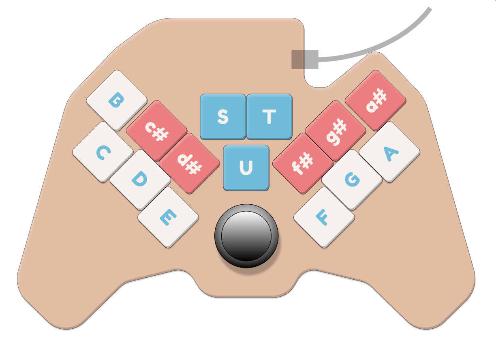

# Thumble

A MIDI controller in the shape of a video game controller (e.g. xbox), but using mechanical-keyboard hardware.

## How it's designed musically; how to play it

Hold it like an Xbox controller.  Play it like a kalimba, with your thumbs.

The diagonal keys are notes; the 3 keys in the middle are extra function keys.  The joystick is for pitch bends, etc.

Unlike a kalimba, the notes are arranged piano style.  There's one octave starting at B on the left and ascending to Bb on the right.  Generally, white keys are on the bottom row and black keys are on the top row.

This is a Shepard Tone keyboard - TODO, explain this.

The special middle keys P, Q, and R have not been assigned to functions yet.  One will be a Shift key which accesses hidden features in the other keys such as transposing, changing MIDI channels, changing system volume, etc.

## Hardware

1. [Feather 32u4 basic proto](https://www.adafruit.com/product/2771), from Adafruit
2. Cherry MX compatible keyswitches (x 15)
    * I used [Gateron Silent Clear](https://novelkeys.xyz/products/gateron-silent-switches?_pos=2&_sid=fd79d8abc&_ss=r) since they have the weakest springs available and no tactile bump
3. Keycaps (x 15)
    * I used these [XDA profile](https://www.amazon.com/gp/product/B092H93KP6/ref=ppx_yo_dt_b_asin_title_o00_s00?ie=UTF8&psc=1) keycaps because they're pretty flat on top so it's easy to slide your thumbs around
4. This [joystick](https://www.adafruit.com/product/245) from Adafruit
4. Some wires
5. Soldering equipment

## Case

The case is laser cut from 7 layers of 1/8 inch material (3mm).  I used plywood and glued the layers, or you could use acrylic and figure out some screw holes.  The SVG files are in the `case` folder.

## Soldering

TODO

## Arduino setup

Install the Adafruit board profiles using instructions from their site.

set board: Adafruit Feather 32u4 basic proto

add libraries: MIDIUSB

